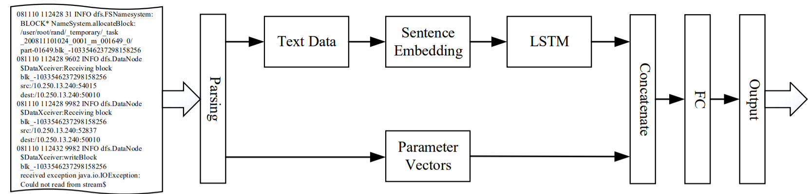

# Note
An early version of test code and data is on the google drive. Following is the link (https://drive.google.com/drive/folders/1jI5SQdT7wZE64E9baQhCMWzTsudfIMoc?usp=sharing)  
# DeepSyslog
implement of DeepSyslog  

framework
## Requirement

- python 3.7
- pytorch >= 1.1.0
## raw data
you can download raw data from (https://zenodo.org/record/3227177)

## log pasing and preprocess  
[logpaser toolkit](https://github.com/logpai/logparser)  
we choose Spell to parse HDFS datasets and Drain to parse BGL datasets.  
The raw logs are seperated to text data and parameters. Then split these composite words into separate parts and remove the stop words. 
place some non-numeric parameters with the label like "ip address","exception","port".  
also save parameters for each log.  

## word embedding  
embedding/w2v model.py  
download pre-trained fastText word vectors from (https://fasttext.cc/docs/en/crawl-vectors.html)  
load pre-trained model and convert it to gensim fastText model then continue to train the model using training data.  

## sentence embedding  
embedding/sif by fse.py  
(https://github.com/oborchers/Fast_Sentence_Embeddings)
implement by fse
load the trained word embedding and choose SIF case of fse to generate sentence embedding
   
 ## model
train and test model in s_p_all.py

## results

| **Dataset** | **Precision** | **Recall** | **F1** |
| :----:|:----:|:----:|:----:|
|HDFS|0.97 | 0.99 | 0.98 |
|BGL |0.98 |0.97 |0.975 |

